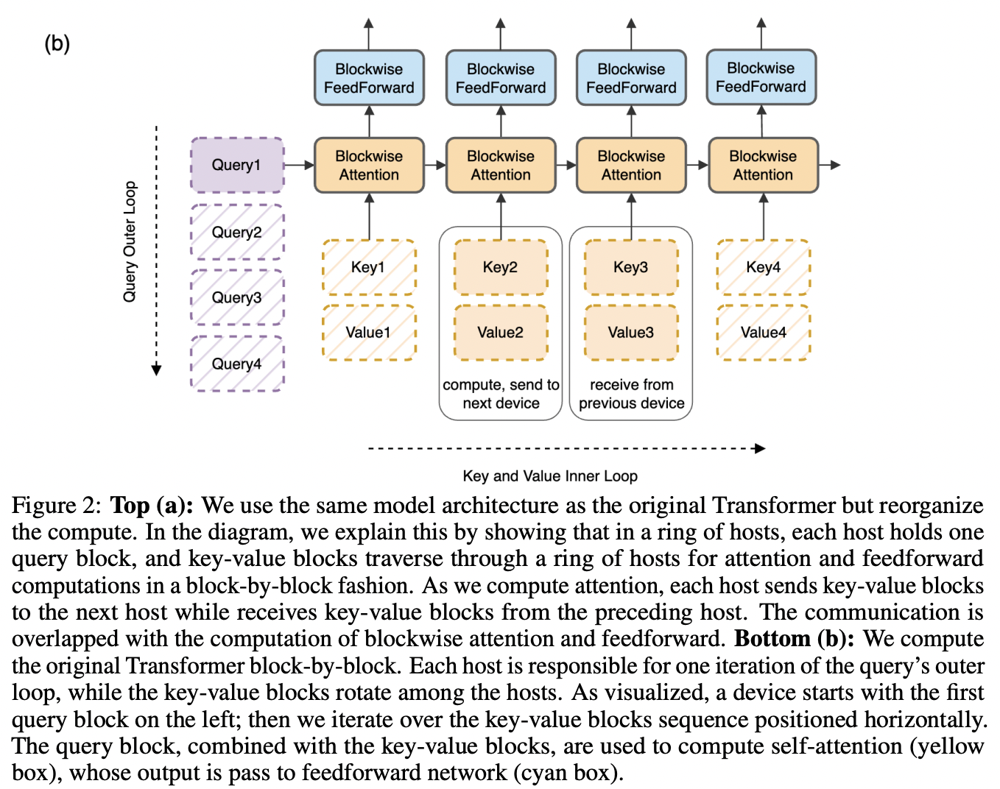

</img>

## Ring Attention - Pytorch

Implementation of <a href="https://arxiv.org/abs/2310.01889">Ring Attention</a>, from <a href="https://www.haoliu.site/">Liu</a> et al. at Berkeley AI, in Pytorch.

It basically splits the data across the sequence dimension (instead of batch) and applies ring reduce to the processing of the tiles of the attention matrix, flash attention style.

I believe this is being used for the 1-10 million tokens for the latest Gemini. At least some form of it; the other possibility would be unpublished improvements on top of <a href="https://github.com/lucidrains/recurrent-memory-transformer-pytorch">RMT</a>.

In addition, the repository also contains the logic for <a href="https://arxiv.org/abs/2311.09431">Striped Attention</a>, a follow up paper that permutes the sequence for better workload balancing for autoregressive transformers.

It also contains support for <a href="https://arxiv.org/abs/2305.13245">grouped query attention</a>, popularized by Llama series of attention models. This will further save on communication costs during the ring reduce.

## Appreciation

- <a href="https://a16z.com/supporting-the-open-source-ai-community/">A16Z Open Source AI Grant Program</a> for the generous sponsorship, as well as my other sponsors, for affording me the independence to open source current artificial intelligence research

- <a href="https://tridao.me/">Tri Dao</a> for all his tremendous hard work maintaining <a href="https://github.com/Dao-AILab/flash-attention">Flash Attention</a> over the last year or two, from which the CUDA version in this repository depends on

- Phil Tillet for <a href="https://github.com/openai/triton">Triton</a>, without which the forward ring flash attention CUDA kernel would have taken a magnitude of order more work.

## Install

```bash
$ pip install ring-attention-pytorch
```

## Usage

```python
import torch
from ring_attention_pytorch import RingAttention

attn = RingAttention(
    dim = 512,
    dim_head = 64,
    heads = 8,
    causal = True,
    auto_shard_seq = True,
    ring_attn = True,
    ring_seq_size = 512
)

tokens = torch.randn(1, 1024, 512)
attended = attn(tokens)

assert attended.shape == tokens.shape
```

## Test

First install requirements

```bash
$ pip install -r requirements.txt
```

Then say testing autoregressive striped ring attention on cuda would be

```bash
$ python assert.py --use-cuda --causal --striped-ring-attn
```

## Todo

- [x] make it work with derived causal mask based on rank and chunk sizes
- [x] modify flash attention to output intermediates and figure out backwards with recompute and ring passes
- [x] functions for splitting the sequence evenly among ranks, either within attention function, or in the external ring transformer wrapper
- [x] basic test case with two processes and check for equivalent output and gradients
- [x] testing
    - [x] make sure key padding mask works
    - [x] make sure causal mask works
    - [x] rotary embeddings, with proper key/value offset depending on ring rank
- [x] striped attention
    - [x] add the permutating logic before and after transformer
    - [x] add causal masking logic - account for sub bucketing by flash attention
- [x] fix issue with ring attention when flash buckets > 1
- [x] move flash attention back to key / value column traversal on outer loop and save on ring communication
    - [x] backwards
    - [x] forwards
- [x] fix rotary positions for striped ring attention when flash buckets > 1
- [x] allow for variable ring passes per layer, for <a href="https://arxiv.org/abs/2007.03356">local -> global attention</a> in ring transformer as one goes up the layers.
- [x] when doing ring passes, alternate between designated send and receive buffers
- [x] instead of max ring passes, able to specify lookback in terms of sequence length, and derive number of flash attention bucket + ring passes from that
- [x] ability to have ring size < world size, sharding the batch and sequence, and doing ring reduce with the correct set of ranks
- [x] add flash attention kernel version in the presence of cuda
    - [x] for forwards, use modified Triton flash attention forwards that outputs row sums, maxes, and exponentiated weighted sum
    - [x] for backwards, use Tri's flash attention kernels, accumulate dq, dk, dv across rings
    - [x] refactor to have naive ring+flash attention work with `(batch, seq, head, dim)`
    - [x] handle key padding mask for forwards by translating mask to bias
    - [x] figure out how Tri handles key padding mask for backwards
    - [x] scale output of flash attention forwards on the last ring pass reduce
    - [x] verify backwards working in a100 runpod
    - [x] dk, dv needs to be float32, while kv needs to be float16. see if both can be cast to int before stacked and ring passed all in one go, then reinterpret back to float32 and float16
    - [x] prevent an unnecessary `tl.load` on the first ring pass
    - [x] cuda backwards pass must have same dq, dk, dv as naive
- [x] fix naive flash attention backwards
- [x] validate cuda causal and striped ring attention works
- [x] make sure cuda striped attention works for multiple buckets, otherwise flash attention is ineffective
- [x] for cuda striped attention, for backwards hack, pad the extra token once and index out when passing into Tri's cuda kernel
- [x] find a machine with 8 GPUs and test with a quarter million tokens first
- [x] see for cuda version whether softmax_D can be computed once and cached over the ring reduce. go for modified triton backwards if not

- [ ] think about how to craft a special `Dataset` that shards across sequence length (take into account labels for cross entropy loss) for ring transformer training
- [ ] add ring attention to Tri's flash attention implementation. find some cuda ring reduce impl
- [ ] figure out how to pytest distributed pytorch
- [ ] use sdp context manager to validate when it is possible to use `ring_flash_attn_cuda`, otherwise assert out
- [ ] improvise a variant where each machine keeps compressed summary tokens, and one only ring pass those summary token for some given distance

## Citations

```bibtex
@article{Liu2023RingAW,
    title    = {Ring Attention with Blockwise Transformers for Near-Infinite Context},
    author   = {Hao Liu and Matei Zaharia and Pieter Abbeel},
    journal  = {ArXiv},
    year     = {2023},
    volume   = {abs/2310.01889},
    url      = {https://api.semanticscholar.org/CorpusID:263608461}
}
```

```bibtex
@article{Brandon2023StripedAF,
    title   = {Striped Attention: Faster Ring Attention for Causal Transformers},
    author  = {William Brandon and Aniruddha Nrusimha and Kevin Qian and Zachary Ankner and Tian Jin and Zhiye Song and Jonathan Ragan-Kelley},
    journal = {ArXiv},
    year    = {2023},
    volume  = {abs/2311.09431},
    url     = {https://api.semanticscholar.org/CorpusID:265220849}
}
```

```bibtex
@article{Dao2022FlashAttentionFA,
    title   = {FlashAttention: Fast and Memory-Efficient Exact Attention with IO-Awareness},
    author  = {Tri Dao and Daniel Y. Fu and Stefano Ermon and Atri Rudra and Christopher R'e},
    journal = {ArXiv},
    year    = {2022},
    volume  = {abs/2205.14135}
}
```

```bibtex
@article{dao2023flashattention2,
    title   = {Flash{A}ttention-2: Faster Attention with Better Parallelism and Work Partitioning,
    author  = {Dao, Tri},
    year    = {2023}
}
```

```bibtex
@article{Tillet2019TritonAI,
    title   = {Triton: an intermediate language and compiler for tiled neural network computations},
    author  = {Philippe Tillet and H. Kung and D. Cox},
    journal = {Proceedings of the 3rd ACM SIGPLAN International Workshop on Machine Learning and Programming Languages},
    year    = {2019}
}
```

```bibtex
@article{Ainslie2023GQATG,
    title   = {GQA: Training Generalized Multi-Query Transformer Models from Multi-Head Checkpoints},
    author  = {Joshua Ainslie and James Lee-Thorp and Michiel de Jong and Yury Zemlyanskiy and Federico Lebr'on and Sumit K. Sanghai},
    journal = {ArXiv},
    year    = {2023},
    volume  = {abs/2305.13245},
    url     = {https://api.semanticscholar.org/CorpusID:258833177}
}
```

*<a href="http://www.incompleteideas.net/IncIdeas/BitterLesson.html">The Bitter Lesson</a>* - Richard Sutton
